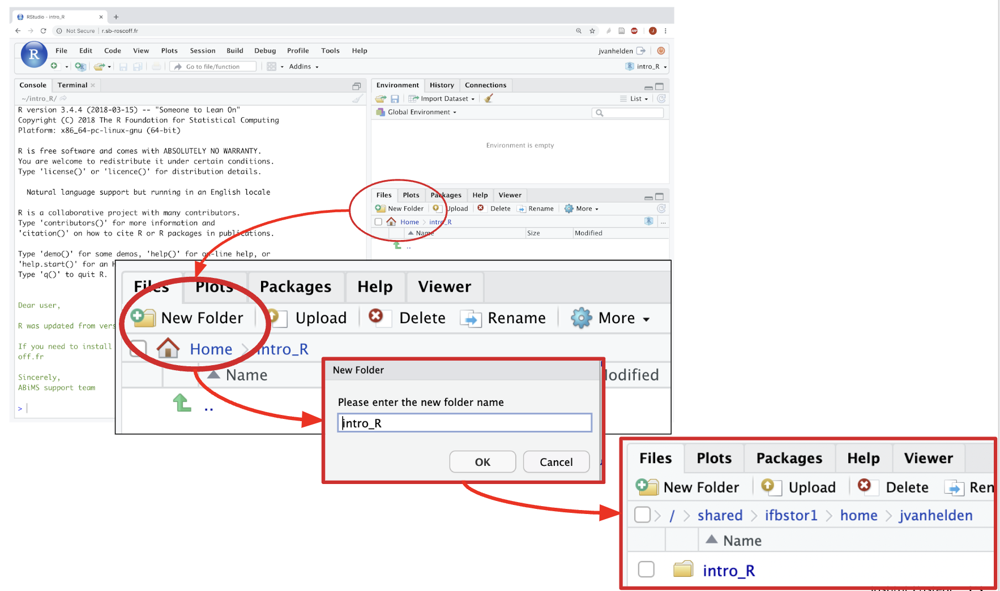
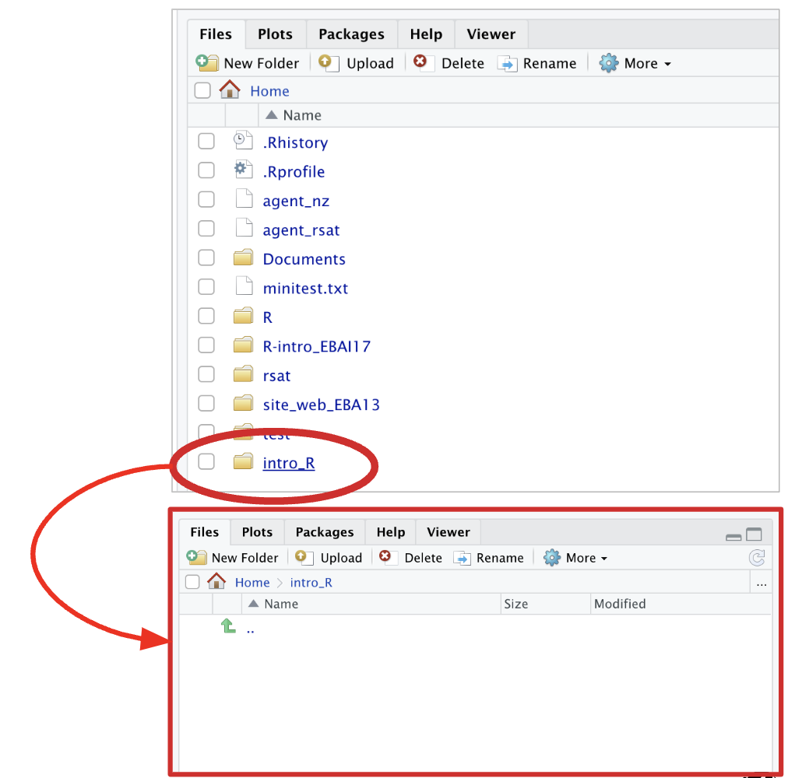
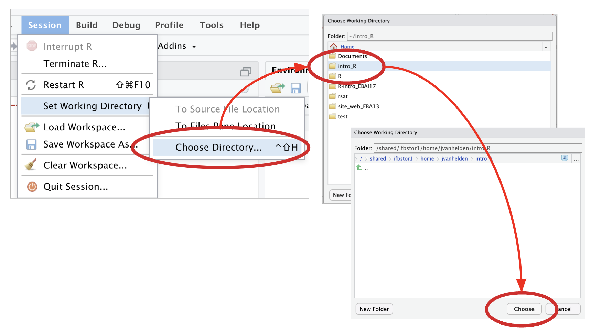
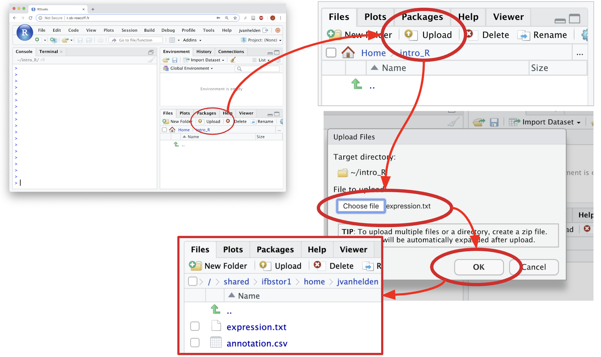
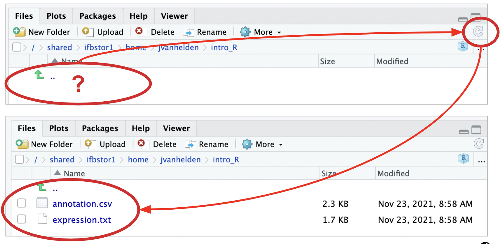

## Version "Avec les boutons"

### Création d’un dossier intro_R pour vos résultats de ce TP

::Admonition
---
type: warning
text: "Dans votre espace projet ou votre home !"
---
::



### Déplacement dans le dossier “intro_R”



### Définissez votre dossier espace de travail (working directory)

1. Dans le menu “Session”, lancez “Choose Directory …”
2. Naviguez jusqu’à votre dossier intro_R
3. Double-cliquez dessus pour l’ouvrir
4. Cliquez Choose



### Téléchargez les fichiers sur votre machine

A partir d’un navigateur Web, téléchargez et enregistrez sur votre ordi les fichiers de données:

- [expression.txt](https://raw.githubusercontent.com/IFB-ElixirFr/EBAII/master/2022/ebaiin1/intro_R/expression.txt){target="_blank"}: données d’expressions pour 4 échantillons
- [annotation.csv](https://raw.githubusercontent.com/IFB-ElixirFr/EBAII/master/2022/ebaiin1/intro_R/annotation.csv){target="_blank"}: informations sur les gènes (id, name, chr, start, stop)

Attention: veillez à sauvegarder les fichiers:

- sous leur nom original,
- avec les extensions .txt et .csv respectives (certains navigateurs omettent l’extension, ce qui poserait problème pour la suite du TP).

### Téléversement (“upload”) des données

Au moyen du bouton “Upload”, téléversez les fichiers d’expression et d’annotation depuis votre ordinateur vers votre compte sur le serveur.  



### On efface tout et on recommence

1. Sélectionnez les deux fichiers
2. Effacez-les sans pitié


(nous allons vous montrer deux autres façons de les téléverser)

## The “R geek” way (V2, directement depuis Rstudio)

Attention ! Dans votre espace projet !

### Creation de l'arborescence

Aller dans **votre** espace projet !

Dans tous les commandes ci-dessous, remplacer toujours `form_2022_32/EBAII_IntroR` par votre nom d'espace projet

Note : Pour les personnes ne travaillant pas sur le cluster mais par exemple en local, vous pouvez sans soucis remplacer l'adresse par une adresse sur votre ordinateur. 

```r
setwd("/shared/ifbstor1/projects/form_2022_32/EBAII_IntroR")
```

Définir une variable qui indique le chemin du dossier de travail (working directory).

```r
my_work_dir <- "/shared/ifbstor1/projects/form_2022_32/EBAII_IntroR/intro_R" 
```

S’il n’existe pas encore, créer le dossier de travail. (Commande Unix équivalente: `mkdir -p /shared/ifbstor1/projects/form_2022_32/EBAII_IntroR/intro_R`)

```r
dir.create(my_work_dir, recursive = TRUE, showWarnings = FALSE)
```

Où suis-je ? (Commande Unix équivalente: `pwd`)

```r
getwd()
```

Aller dans ce dossier de travail (Commande Unix équivalente: `cd /shared/ifbstor1/projects/form_2022_32/EBAII_IntroR/intro_R`)

```r
setwd(my_work_dir)
```

Et maintenant, où suis-je ?

```r
getwd()
```

Qu'y a-t-il par ici ?  (Commande Unix équivalente: `ls`)

```r
list.files()
```

Un autre nom pour la même commande

```r
dir()
```

### Télécharger un fichier

Nous avons montré ci-dessus comment télécharger des fichiers en utilisant l’interface graphique de RStudio.

Alternativement, on peut télécharger des fichiers au moyen de la commande R download.file. 

Les deux commandes suivantes permettent de télécharger les fichiers utilisés pour les exercices.

```r
download.file(url = "https://raw.githubusercontent.com/IFB-ElixirFr/EBAII/master/2022/ebaiin1/intro_R/expression.txt", destfile = "expression.txt")
```

```r
download.file(url = "https://raw.githubusercontent.com/IFB-ElixirFr/EBAII/master/2022/ebaiin1/intro_R/annotation.csv", destfile = "annotation.csv")
```

Note : équivalent de la commande `wget` sous Unix.

Qu'y a-t-il par ici ?  (Commande Unix équivalente: `ls`)

```r
list.files()
```

### On efface tout et on recommence

1. Sélectionnez les deux fichiers
2. Effacez-les sans pitié


Nous allons vous montrer une dernière façon de les téléverser.

## The “bash geek” way (V3, directement de votre home du cluster)

Objectif

Dans le terminal du cluster, téléchargez et enregistrez dans votre home les fichiers de données:

- expression.txt: données d’expressions pour 4 échantillons
- annotation.csv: informations sur les gènes (id, name, chr, start, stop)

Ouvrez un connection ssh

```bash
ssh [votre_login]@core.cluster.france-bioinformatique.fr
```

Où suis-je ?
```bash
pwd
```

Créez un répertoire “intro_R”  

```bash
mkdir -p /shared/ifbstor1/projects/form_2022_32/EBAII_IntroR/intro_R
```

Déplacez-vous dans votre dossier

```bash
cd /shared/ifbstor1/projects/form_2022_32/EBAII_IntroR/intro_R
```

Où suis-je maintenant ?

```bash
pwd
```


Téléchargez les données
```bash
wget https://raw.githubusercontent.com/IFB-ElixirFr/EBAII/master/2022/ebaiin1/intro_R/expression.txt --output-document=expression.txt
```

```bash
wget https://raw.githubusercontent.com/IFB-ElixirFr/EBAII/master/2022/ebaiin1/intro_R/annotation.csv -O annotation.csv
```

Qu’y a-t-il ici ?

```bash
ls -l
```

A quoi ressemblent ces fichiers ?

```bash
head expression.txt
```

```bash
head annotation.csv
```


## Actualisation du dossier

Dans certains cas, il faut actualiser le contenu du dossier pour pouvoir voir le nouveau sous-dossier.
Vérifiez ensuite si `intro_R` apparaît bien dans le contenu de votre dossier principal.



