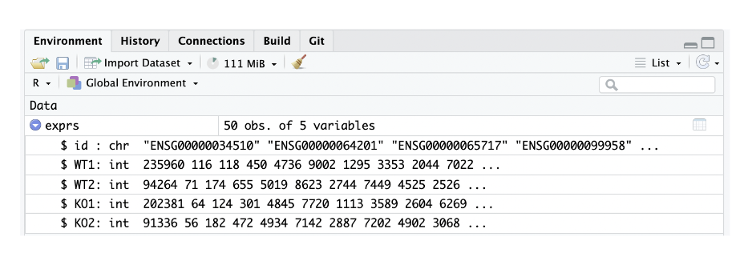

## Chargement des données (dans la mémoire de R)

Charger le contenu du fichier "expression.txt" dans une variable nommée "exprs".

```r
exprs <- read.table(file = "expression.txt", header = TRUE, sep = "\t")
```

Accéder à l'aide d'une fonction

```r
help(read.table)
```

Notation alternative

```r
?read.table
```

Recherche interactive sous RStudio

- Sélectionner l’onglet “Help” du panneau inférieur droit.
- Taper “read.table” dans la boîte de recherche.


Sinon, une approche plus simple et plus pratique :

- demande à Google “Comment lire une table en R ?”
- adapte l’exemple

## Affichage de l’objet “exprs”

Imprimer toutes les valeurs.

```r
print(exprs)
```

Affichage des premières lignes de l'objet

```r
head(exprs)
```

Affichage des dernières lignes de l'objet

```r
tail(exprs)
```

Un peu plus de lignes

```r
head(exprs, n = 15)
```

Explorer le tableau dans un panneau de visualisation

```r
View(exprs)
```
::Admonition
---
type: note
text: " vous pouvez cliquer sur une en-tête de colonne pour trier les données"
---
::


Explorer le tableau avec le package [DT](https://rstudio.github.io/DT/){target="_blank"}.

```r
library(DT)
datatable(exprs)
```

## Caractéristiques d’un tableau de données

### Dimensions

Nombre de colonnes

```r
ncol(exprs)
```

Nombre de lignes

```r
nrow(exprs)
```

Dimensions

```r
dim(exprs)
```

### Noms des colonnes et des lignes

Noms des colonnes

```r
colnames(exprs)
```

Idem

```r
names(exprs) 
```

Noms des lignes

```r
rownames(exprs)
```

### Résumé rapide des données par colonne

Statistiques par colonne

```r
summary(exprs)
```

Structure de la variable

```r
str(exprs)
```

Même résultat que dans le panneau “Environment”


